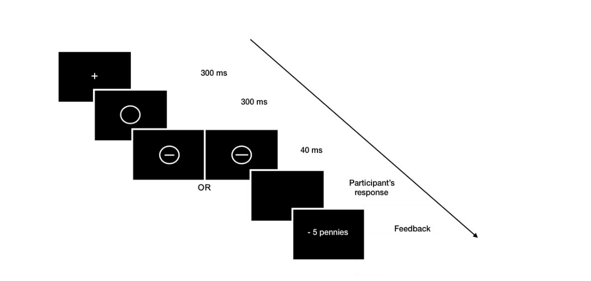
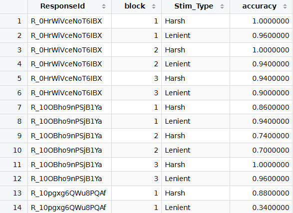

The exercise of today has three main learning objectives. First, this is the first TD where you will be working with a real, raw dataset that was not pre-processed to make it more accessible for students. The dataset you will be working with is the immediate output, without cleaning, that comes out of the survey software (*Qualtrics*) that was used to run the study. The analysis you will conduct here is exactly the analysis that I had to conduct analyzing this data. The second is to develop first-hand experience with data from cognitive psychology, and get a sense of what challenges they typically pose. The third is to practice how to transform data and turn it into tidy data.

The dataset comes from a cognitive task I had designed as an intern in 2020. After launching the experiment and collecting the data, I quickly realized how messy real‑world data can be—very different from the clean, artificial datasets I had worked with in class. This messiness had two main causes. First, some mistakes and sub‑optimal design choices on my part made the data harder to interpret. Second, there were structural limitations in the data‑collection software (*Qualtrics*) that shaped the data in ways that favored collection rather than analysis. I later learned that this is a common issue: data is often structurally messy because of practical constraints during collection. As a result, before running any analyses, I had to first clean and reorganize the data.

# Instructions (read carefully!)

- Submit this TD as one .qmd document and its rendered .html document on Canvas by the end of this session.

- Make sure to follow the proper workflow: make sure your script, the dataset and all relevant documents are in the same file/working directory.

- You are **not allowed to use AI at all** throughout the duration of this TD. If you're stuck, don't hesitate to reach out to Zakia or myself

- Code must appear, but not warning messages and console outputs

- Code must be well-commented and clearly written (e.g. clear variable names, coherent spacing)

- Write properly. I don't mean grammar or spelling, I mean: make sure that it's easy, clear and pleasant to read you. The best tip I can give is to imagine a classmate reading your paper: would they understand easily? would everything be clear?

# Context

#### General question: introducing the puzzle

Why do behaviors vary depending on one's social class or socio-economic environment? A growing body of literature documents that material insecurity had consistent effects on cognition. A common approach in the literature is the deficit model: the idea that material insecurity and repeated exposure to stress results in "cognitive impairments" that are detrimental to the poor. In 2020, I began my first cognitive science internship along with two cognitive scientists, where we tried to propose an alternative pathway. Our general idea was that the effect of material insecurity on cognitive processes were not "impairments", but rational adaptations to the constraints of the environment.

#### Introducing the hypothesis, and the underlying behavioral mechanism

We were specifically interested in threat reactivity: people's tendency to avoid stimuli associated with threats. Our idea was that people living in material insecurity have more to lose from threat exposures. When exposed to a threat, wealthy individuals can buffer their loss (e.g. they might have savings, or own their house, which mitigates the negative impacts of losing one's job) whereas for poorer individuals any threat can bring a fatal loss.

#### Hypothesis (conceptual)

For this reason, we hypothesized that people living in material insecurity would exhibit a greater threat reactivity.

#### Hypothesis (operational)

Threat reactivity was operationalized and measured using a cognitive task. In this task, participants made repeated decisions that were matched with rewards (or positive feedback) and punishments (or negative feedback).

Participants completed a simple task consisted of multiple trials. In each trial, they had to make quick decisions. They were shown two lines: a shorter one and a longer one, and they had to tell which one it was (see Figure below). When they made a mistake, they were sometimes at random "punished" (they lost money from their initial endowment, so they would be paid less at the end of the experiment). Importantly, we introduced an asymmetry in the punishments. One line was punished on average 75% of failures (the "harsh" line) while the other was punished on average 25% of failures (the "lenient" line).

Each task consisted in a series of trials (i.e. everytime the participant answers "short or long"), themselves divided into three blocks. From this task, we measure how *accurate* participants were, *how fast* they responded, and *how their decision strategy changed depending on which line appeared.* The key outcome variable for us in the dataset is *threat reactivity score*, which captures how much a participant became more avoidant of the harsh line between the first and the last block. A high threat reactivity score means that someone rapidly and strongly changed their patterns of answers to avoid punishment; whereas a low score indicates that participants roughly kept answering in the same way, making no particular effort to avoid punishments. In other words, this score tells us how sensitive someone is to threatening stimuli.

Material insecurity was operationalized as subjective socio-economic position. This was measure by a survey question asking participants to situate themselves on a ladder from the lowest to highest decile of UK society (1 to 10).



# Exercises

Unless specified otherwise, all relevant information (functions, syntax, techniques...) necessary to answer the following question are available in the readings for today (available here: <https://r4ds.hadley.nz>), in the Spotify template, or in the Chunks.R file we saw the other day.

### Question 1

*1A:*

Load the negativity_bias csv file. Look closely at the data. Are all rows useful data? If not, remove the useless rows, and explain your decision.

*NB: you can use this tutorial: <https://www.statology.org/dplyr-remove-rows/>*

*1B:*

What does each row represent?

### Question 2

Ideally, we'd like to only keep participants who completed the study. Qualtrics gives a measure of participant progress, in %, under the 'Progress' variable. Remove participants who didn't complete the study. How many observations are left?

### Question 3

We also have data on study duration (in seconds): you can easily find the relevant variable. Remove participants whose duration is 3 standard deviations above or below the mean duration of the study (it's a common procedure to remove extreme cases in the data). How many observations are left?

### Question 4

Look at the variable names. You'll find that most of them have an "intuitive" name that matches what is measured. But this is because I took the time to give a proper name to these variables on Qualtrics. There are other variables that I didn't name, so Qualtrics gave me the default name. For instance: see the three variables that start with Q570. They represent three variables measuring people's perceived material security (Q570_1: I have enough money to buy the things I want; Q570_2: I have enough money to pay the bills; Q570_3: I think I will have to worry about money in the future).

Give each variable a more natural name and give the mean value of each.

NB: you can use the following tutorials:

- Change variable name: <https://www.statology.org/dplyr-rename-column/>

- Convert into numeric characters: <https://www.geeksforgeeks.org/r-language/how-to-convert-character-to-numeric-in-r/>

### Question 5

Look at the Q571 variable. This variable corresponds to a question asking the participant to imagine his country's wealth distribution as a ladder, and say whether he feels more at the top (10) or at the bottom (1).

*Calculate the mean of this variable. Is it plausible?*

### Question 6

Look closely at the variable. You can use the *unique()* function to look at all of the values that the variable takes in your dataset. *What seems to be happening? Propose a solution to the problem.*

**NB: AT THIS POINT, CALL ZAKIA OR I TO CHECK YOUR PROGRESS**

### Question 7

Look closely at the 'results' section. What makes this variable weird? (you don't have to understand it right now, just answer what 'feels' weird with this variable).

### Question 8

As you can see, the 'results' columns consists in sequences of numbers (e.g.: 1.1,0,1,1,0,0,1,1352) separated by a semicolon (;). You don't need to understand what each number represents right now; just remember that each sequence corresponds to one *trial*, and that each number in each sequence represents crucial data about that trial.

Use separate_rows() to give each trial its own row. Do this by creating a new dataframe object called data_long (but keep the current dataframe, you'll need it later). Beware: using separate_rows() can sometimes create void values (there are not NA: but rather rows where the value is a blank). Before you move on, make sure that you check that the new results column does not have blank columns, and if it does remove them, with the argument:

```         
filter(results != "") 
```

**How many rows did your dataframe have, and how many rows does it have now in data_long? What happened?**

*NB: We haven't seen the separate_rows() function. The objective of this exercise is to teach you how to figure out how to use a function by yourself. Remember, using AI is not authorized. You can try the ? function in the console. Or, you can Google it and hope to find a useful tutorial.*

### Question 9

Each row in the results column in data_long currently looks like this: 1.1,0,1,1,0,0,1,1352. This data structure matches the way data was collected in each row in Qualtrics.

In the respective order, this sequence captures crucial information about each trial: Condition (1.1 or 1.2 or 2.1 or 2.2), Block (0 or 1 or 2 or 3), the n° of the trial, whether the image was long (1) or short (0), whether the participant *said* it was long (1) or short (0), whether the participant was correct (1) or not (0), whether the punishment was displayed (1) or not (0), and response time in milliseconds.

*Use the separate() function to split the results column into these 8 distinct variables.* In the respective order, the variables should be named: "condition", "block", "nTrial", "is_long", "responded_long", "is_correct", "punishment", "rt".

Try to describe what happened to your data. Is the resulting dataframe tidy? Explain.

**NB: AT THIS POINT, CALL ZAKIA OR I TO CHECK YOUR PROGRESS**

### Question 10

Depending on the condition, whether the short or the long line was the most punished one varied. To simplify, let's categorize for each trial whether it was the 'Harsh' (i.e. most punished) line or the 'Lenient' (i.e. least punished) that was presented to the participant. To achieve this, run this code:

```{r}
#| eval: false
data_long <- data_long %>% 
  mutate(Stim_Type = case_when(
    (condition == 1.1 | condition == 2.1) & is_long == 1 ~ "Harsh",
    (condition == 1.1 | condition == 2.1) & is_long == 0 ~ "Lenient",
    (condition == 1.2 | condition == 2.2) & is_long == 1 ~ "Lenient",
    (condition == 1.2 | condition == 2.2) & is_long == 0 ~ "Harsh"
  ))
```

You now have a new Stim_Type variable, which tells you what kind of line (Harsh or Lenient) appeared in each trial.

Verify that, indeed, when the participant was wrong, they were more likely to be punished when confronted to a "Harsh" than a "Lenient" line, and that the probabilities match with what is expected (around 75% vs. 25% chance of punishment). Whenever you run a study that involves randomization, it's always a good idea to check whether this randomization was successful.

*In this case, was the randomization successful?*

### Question 11

The *accuracy* of a participant is its rate of correct responses. Was accuracy the same for Harsh and Lenient lines? Did this evolve across blocks?

### Question 12

The point of the study was to measure "bias" (i.e. how much participant reponses change when they see the Harsh or Lenient line), and how this bias evolves over time. The standard formula to calculate bias is:

```         
Bias of an individual = 0.5 * log((Accuracy for Harsh * (1 - Accuracy for Lenient)) / ((1 - Accuracy for Harsh) * Accuracy for Lenient))
```

You don't need to understand the detailed maths here, but intuitively, you can see that the more accuracy for Harsh lines is superior to the accuracy for Lenient lines, the higher the bias (i.e. individuals only respond Harsh when they're ultra sure, probably to avoid punishment. A high bias thus demonstrates that individuals actively tried to avoid the Harsh line. By contrast, individuals with a low bias show a lower degree of avoidance: they were more relaxed, and sometimes tried to answer the Harsh line even without being absolutely sure.

To calculate bias, we'll create **a new dataframe object called summary_data**.

*12A:*

Look at the 'block' variable. Remember that the cognitive task consists in three blocks. Yet, you might see values of 0 or NA. This is because the study also involved a tutorial, that we don't need to analyze.

First, remove all rows for which the value of *block* is not 1, 2 or 3.

*12B:*

Create a dataset called summary_data, which shows the mean accuracy depending on three variables: ResponseId (the variable indicating the participant unique identifier), block and Stim_Type (see Figure below).



*12C:*

Right now, your Harsh scores and Lenient scores are in different rows. *To compare them easily, use pivot_wider() on the summary_data dataframe so that 'Harsh' and 'Lenient' become their own columns.*

Describe what happened to your data.

### Question 13

Once you have your summary_data dataframe in the right format, create a 'bias' variable representing participants' bias as per the formula presented earlier.

NB: You may see `Inf` values in your results. This happens when accuracy is exactly 1. This is a common occurrence in this type of behavioral tasks. To fix this, before creating the bias variable you must write a code that transforms the accuracy columns: whenever a value is equal to **1**, change it to **0.99**; and whenever a value is equal to **0**, change it to **0.01**.

### Question 14

Now that you have a bias value for every block, we would like to calculate a *threat_reactivity* variable for each participant, representing the bias at block 3 *minus* the bias at block 1.

But you'll notice a problem: the bias for Block 1 and the bias for Block 3 are in different rows. To perform mathematical operations between different blocks (like substracting one by the other), it is much easier if those values are side-by-side in the same row.

*14A:*

*Use the pivot_wider()* function to reshape the dataframe, such that each block's bias gets its own column. Before running pivot_wider(), **make sure that you select() only the relevant columns**: ResponseId, block, and bias.

How many columns do you have now?

*14B:*

Once your dataset is in the right format, create a variable that captures the threat_reactivity score for each participant.

*What is the mean threat reactivity score?*

*14C:*

Create a plot showing the distribution of threat reactivity scores. You can get inspiration from the Spotify template code for descriptive statistics.

### Question 15

You now have the threat reactivity score for every participant. It's now time to test whether this variable is correlated to the participants' subjective wealth. But in your current summary_data dataframe, you don't have this latter variable.

So you need to **merge** this dataset to your original dataset; where you actually had the subjective wealth per participant.

First, using the original dataset, create a smaller dataframe called small_data that contains only the two columns we need (you can use select() for that): ResponseId and the Q571 (the column for subjective SES). This way, we don't carry around unnecessary columns.

Then use the *left_join()* function to merge the two datasets to produce a new dataframe (call it final_data) that has both the threat_reactivity score and subjective wealth of all participants. Explain what this function does.

### Question 16

Is there a correlation between a participant's threat reactivity score and their subjective wealth? (you can use the cor.test function to run a correlation). Conclude.

::: callout-note
## Multilevel data in psychology

The data structure you observe in this dataset is what we call **multilevel data** (or, nested data, or hiererchical data): this is when you have data at multiple levels. Here, you have participant-level data (e.g. participant ID, date of birth, subjective wealth...). But because each participant goes through multiple trials, and we collect information in each trial, we also have trial-level information (e.g. whether the short or long line showed, what the participant answered, whether he received a punishment, etc...). This structure is typical in psychology, where it's common to have **repeated measures** by participant (most often because participants usually go through multiple trials).

Multilevel data must be addressed. The first question we need to ask is whether we want to focus on participant- or trial-level data. In the first case, we can use the dataset as we downloaded it: with few observations (one per participant)... but we lose the information about trials. Often, we want to work with trial-level data. This usually means we expand the dataset, considerably increasing the number of rows, as we did here. This format of data is called "long data". When in doubt, working with multilevel data, it is always best to work with a long data format, not least because it generally matches the criteria for a tidy dataframe.

Here, we moved to long format, but we used it to calculate a participant-level variable (specifically: threat reactivity). To calculate it, we needed to have all trial-level info, but ultimately, threat reactivity is a characteristic of the participant. Indeed, for our specific research question, we needed a participant-level correlation: threat reactivity with subjective socio-economic status.
:::

### Question 17

Write a plot to show the results.
